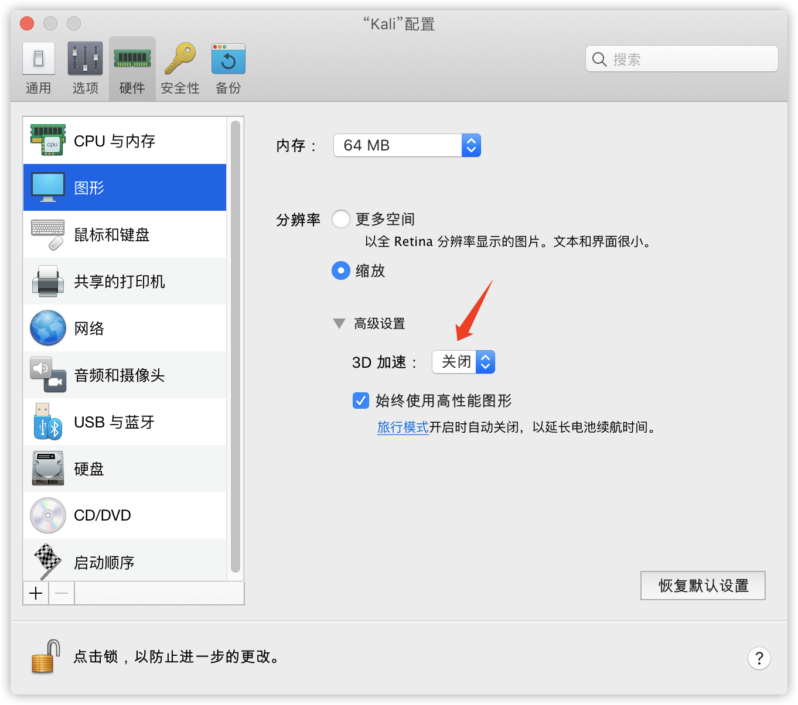

### 0.安装过程遇到的主要问题：

- 1.Parallels Tools 安装时的 /media/cdrom0权限问题
- 2.Kali 的 apt-get源
- 3.Parallels Tools 自动安装依赖无法安装 linux-headers
- 4.makefile编译失败
- 5.安装 Parallels Tools 后 Kali 登陆后白屏

### 1.Parallels Tools 安装时 /media/cdrom0权限问题

点击安装`parallels tools`的时候，会有提示框，提示权限问题，如果直接运行`install`脚本，提示权限不够，官方推荐的做法：

- 先卸载`# umount /media/cdrom0`
- 再挂载`# mount -o exec /media/cdrom0`
  按以上操作，依旧提示`# mount: /media/cdrom0: WARNING: device write-protected, mounted read-only.`

解决方案：
很简单，直接把文件复制到出来，然后`chmod 777 -R .`赋权即可~

### 2.Kali 的 apt-get 源

以下可用源填入`/etc/apt/sources.list`即可

```
#中科大
deb http://mirrors.ustc.edu.cn/kali kali-rolling main non-free contrib
deb-src http://mirrors.ustc.edu.cn/kali kali-rolling main non-free contrib
#阿里云
deb http://mirrors.aliyun.com/kali kali-rolling main non-free contrib
deb-src http://mirrors.aliyun.com/kali kali-rolling main non-free contrib
#清华大学
deb http://mirrors.tuna.tsinghua.edu.cn/kali kali-rolling main contrib non-free
deb-src https://mirrors.tuna.tsinghua.edu.cn/kali kali-rolling main contrib non-free
#官方源
deb http://http.kali.org/kali kali-rolling main non-free contrib
deb-src http://http.kali.org/kali kali-rolling main non-free contrib
```

更新完依次执行

```
apt-get update
apt-get upgrade -y
apt-get dist-upgrade -y
apt-get clean
```

### 3.Parallels Tools 自动安装依赖无法安装 linux-headers

接下来的错误都是要查看日志文件了

```
# cat /var/log/parallels-tools-install.log
```

如果是无法安装`linux-headers`的话，就要手动安装。
先查看内核版本

```
# uname -a
```

然后来这里<http://http.kali.org/kali/pool/main/l/linux/>下载三个对应内核版本的安装包手动安装

- linux-kbuild: linux-kbuild-xxxx_amd64.deb
- linux-header-common: linux-headers-xxxx-common_xxxx_amd64.deb
- linux-compiler-gcc: linux-compiler-gcc-xxx-amd64.deb
- linux-headers: linux-headers-xxxx_amd64.deb
  下载完成后，用dpkg命令安装deb包。

<!---->

```
# dpkg -i xxxxx.deb
```

### 4.makefile编译失败

依旧查看日志文件，发现错误在`make`命令。

##### Parallels Desktop版本过低

这种情况下，make错误会在诸如`get_user_pages()`等linux接口，之前一直用的是Parallels Desktop11，这次重新下了最新的kali，内核号是`4.15`，于是升级了Parallels Desktop,重新安装。

##### Linux版本过高

尽管升级了PD，还是会有make错误，看日志发现死在了`prl_xxx`下的某些函数，原因是因为Parallels Tools不支持4.15的Linux内核，只能改源码了。具体修改如下：

- 解压`kmods/prl_mod.tar`

<!---->

```
# tar -xzf kmods/prl_mod.tar.gz
# rm prl_mod.tar.gz
```

- 修改`prl_eth/pvmnet/pvmnet.c`

<!---->

```
# vi kmods/prl_eth/pvmnet/pvmnet.c
# 编辑第438行，将其中的“Parallels”替换为“GPL”
#MODULE_LICENSE("Parallels")
MODULE_LICENSE("GPL")
```

- 修改`prl_tg/Toolgate/Guest/Linux/prl_tg/prltg.c`

<!---->

```
# vi prl_tg/Toolgate/Guest/Linux/prl_tg/prltg.c
# 编辑第1535行，同样是将“Parallels”替换为“GPL”
```

- 修改`prl_fs_freeze/Snapshot/Guest/Linux/prl_freeze/prl_fs_freeze.c`

<!---->

```
//第一步：增加函数
//第212行
void thaw_timer_fn(unsigned long data)
{
   struct work_struct *work = (struct work_struct *)data;
   schedule_work(work);
}
//后面增加以下函数
void thaw_timer_fn_new_kernel(struct timer_list *data)
{
   struct work_struct *work = data->expires;
   schedule_work(work);
}
//第二步：修改宏
//刚刚的位置往下两行的
DEFINE_TIMER(thaw_timer, thaw_timer_fn, 0, (unsigned long)&(thaw_work));
//改为
#if LINUX_VERSION_CODE >= KERNEL_VERSION(4, 15, 0)
DEFINE_TIMER(thaw_timer, thaw_timer_fn_new_kernel);
#else
DEFINE_TIMER(thaw_timer, thaw_timer_fn, 0, (unsigned long)&(thaw_work));
#endif
```

- 重新打包`prl_mod.tar.gz`

```shell
tar -zcvf prl_mod.tar.gz . dkms.conf Makefile.kmods
```

### 5.安装 Parallels Tools 后 Kali 登陆后白屏
